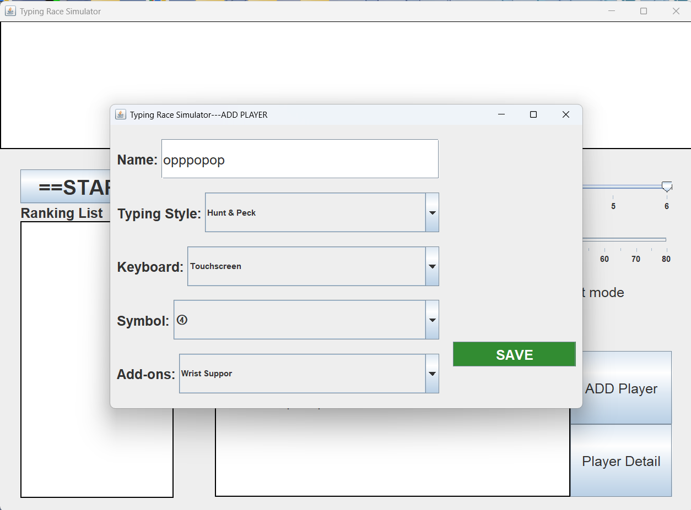
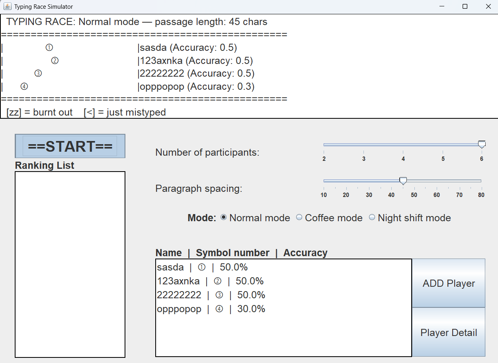
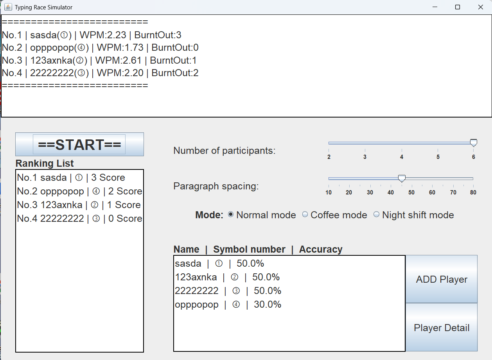

# Typing Race Simulator

Project Version - 0.0.8v

Java Version - 26.0.1

Javac Version - 26.0.1

## Project Introduction

Typing Race Simulator is a typing race simulator project based on Java object-oriented programming. It includes command line core logic, graphical interactive interface and Git version control.

## Directory Structure Description

TypingRaceSimulator\
├── Part1\
│   ├── TypingRace.java\
│   ├── startRace.java  // Test file\
│   ├── Typist.java\
│   └── Typist_Test.java  // Test file\
│\
├── Part2\
│   ├── ADDPLAYER_Win.java\
│   ├── DisplayListClass.java\
│   ├── MainStartDisplay.java\
│   ├── SetSymbolArray.java\
│   ├── TypingRaceGUI.java\
│   ├── startRaceGUI.java // Launching the program (main)\
│   └── Typist.java\
│\
├── pic\
│  
└── README.md

## Project dependencies(Java Library)
- javax.swing.*;
  - javax.swing.border.LineBorder;
  - javax.swing.border.LineBorder;
- java.awt.*;
- java.util.ArrayList;
- java.util.Comparator;
- java.util.Collections;
- java.util.NoSuchElementException; 


***

## Part 2 Program Description

### startRaceGUI.java

This is the building block of the main window, which mainly contains

1. Main game display
2. Number of characters slider
3. Paragraph word distance
4. Mode selection
5. Participant character display
6. Add participant
7. Participant details
8. Ranking list
9. start case

****
### ADDPLAYER_Win.java
This file is primarily used to display the window for adding players and displaying player details.

Because the Add player and Player Detail Windows are the same. Different parameters through transmission are distinguished using if for different detail additions

In this section, the same method will be called when both buttons are clicked, but the first argument passed will be different.

**When Add Player is clicked**
```
addPlayer.addActionListener(e -> {
    GameDisplay.SetDisplayheight(PlayerDisplay.getModel().getSize());
    if (setPeopleSlider.getValue()>PlayerDisplay.getModel().getSize()) {

        new ADDPLAYER_Win(null,SymbolsArrays,PlayerDisplay); //!!!!!!!! HERE

    }

});
```

**When Player Details is clicked**
```
DetailPlayer.addActionListener(e -> {

    try {
        int selectedIndex = PlayerDisplay.getSelectedIndex();
        Typist selectedClass = PlayerDisplay.getDataClass(selectedIndex);

        new ADDPLAYER_Win(selectedClass, SymbolsArrays, PlayerDisplay); //!!!!!!!! HERE

    }catch (IndexOutOfBoundsException ex){

    }

});
```
\
If it is null (meaning no actor was selected), ADDPlayer is executed and EDITPlayer is executed if not.
\
```ADDPLAYER_Win.java
if (TyClass == null){
    ADDPlayer(TyClass);
}else {
    EDITPlayer(TyClass);
}
```
\
In order to avoid too much and repetitive code I made the equipment selection drop-down box into a class and added repeated but different content drop-down boxes to the window
\
```
private final JLabel NameLabel;
private final JComboBox<Item> ComboBoxArray;

static class Item {
    String name;
    String desc;
    public Item(String TypeName, String name, String desc1,String desc2) {
        this.name = name;
        this.desc = "burnout:"+desc1+" & accuracy:"+desc2;
        if (TypeName.equals("Symbol: ")) this.desc = "";

    }
    @Override
        public String toString() {

        return name;
    }
}

public ComboxPanel(String Name, String[][] CArray){
    this.setLayout(new BorderLayout());
    this.setBorder(BorderFactory.createEmptyBorder(10, 0, 10, 0));

    Item[] items = new Item[CArray.length];
    for (int i = 0; i < CArray.length; i++) {
        items[i] = new Item(Name, CArray[i][0], CArray[i][1], CArray[i][2]);
    }

    NameLabel = new JLabel(Name);
    NameLabel.setFont(new Font("", Font.BOLD, 20));

    ComboBoxArray = new JComboBox<>(items);

    ComboBoxArray.setRenderer(new DefaultListCellRenderer() {
        @Override
        public Component getListCellRendererComponent(JList<?> list, Object value, int index, boolean isSelected, boolean cellHasFocus) {
            super.getListCellRendererComponent(list, value, index, isSelected, cellHasFocus);
            if (value instanceof Item item) {
                if (index == -1) {
                    setText(item.name);
                } else {
                    setText("<html><font size=5 color=black>" + item.name + "</font><br><font size=4 color=gray>" + item.desc + "</font></html>");
                }
            }
            return this;
        }
    });

    this.add(NameLabel,BorderLayout.WEST);
     this.add(ComboBoxArray,BorderLayout.CENTER);
}
```
This can be used to create a complex and versatile drop-down box with only the following method

ComboxPanel *Example* = new ComboxPanel(*The text of the drop-down box* ,  *Use a two-dimensional array to add equipment names and attributes*);

```
JLabel TypingStyleLabel = new JLabel("Typing Style: ");
TypingStyleLabel.setFont(new Font("", Font.BOLD ,20));

String[][]  TypingStyleArray = new String[][]{{"Not equipped","+0","+0"},{"Touch Typist","-0.3","-0.3"},{"Hunt & Peck","+0.3","+0.3"}, {"Phone Thumbs","+0.3","-0.2"},{"Voice-to-Tex","-0.4","+0.7"}};

TypingStyleCombobox = new ComboxPanel("Typing Style: ",TypingStyleArray);
```

****

### DisplayListClass.java

All JLists in the project will be created from this file.You'll store Class T in the list by creating classes that can be retrieved as needed.


Inheriting from JList<String> allows you to omit calls and abbreviate your code.
```
public DisplayListClass() {
    PlayerClassArray();
    this.setVisibleRowCount(6);
    this.setBorder(new LineBorder(Color.BLACK, 2));
    this.setFont(new Font("", Font.PLAIN, 20));
}
```

When displaying the content, the difference between the ranking and the player display of the two Jlists is realized by passing the parameter of DorR(Display Players or Ranking List).
```
if (DorR) {
    returnName[i] = getfName + "  |  " + getfSymbol + "  |  " + getfAccuracy * 100 + "%";
    }else {
    returnName[i] = "No." + (i+1)+ " " + getfName + " | " + getfSymbol + " | " + peopleData.get(i).sumScoreR() +" Score";
}
```

This is the part that is mainly used to sort the ranked list. Build and reorder based on the obtained score
```
peopleData.sort((p1, p2) -> Integer.compare(p2.sumScoreR(), p1.sumScoreR()));
```

****
### MainStartDisplay.java
This is the JTextArea used to display the race. In the TypingRace file provided by the school, multiplePrint is used to display multiple "characters" on a line. After rebuilding TypingRace decided it would be more convenient to put multiplePrint in MainStrartDisplay. If you need to call it again or create a new JTextArea later, you can do it regardless of TypingRace

```
public String multiplePrint(char character, int num){

    int i = 0;
    String longStrings = "";
    while (i < num)
    {
        longStrings=longStrings+character;
        i = i + 1;
    }
    return longStrings;
}
```
****
### SetSymbolArray.java

This file is used to manage the symbols of adding participants. It is managed globally by creating a new class in the main method, which can be added, deleted, deleted when the user selects and confirms, and added when the participant is deleted

****

### TypingRaceGUI.java

This is a re-edit from the TypingRace file, replacing any *System.out.println* or *System.out.print* with *GameDisplay.showText();*

```
GameDisplay.showText( The text you need to output );
```

Of course, you can't use the original time module on the basis of using Swing, otherwise you will have a serious problem, and the text will not be displayed until the delay is over. This causes the window to flicker

TypingRace.java
``` 
// Wait 200ms between turns so the animation is visible
try {
    TimeUnit.MILLISECONDS.sleep(200);
        } catch (Exception e) {}
```

TypingRaceGUI.java
```
try { 
    Thread.sleep(200); 
} catch (Exception e) {}
```
****
## Example Run Demonstration

**Create participants:**



**The competition is in progress:**



**Game Over:**




****
## Version Update History
## - 0.0.1 - 
- Creating the main window
- Add the game display area
- Add Add Player button
- Add Player Details button
- Add a Start button
## - 0.0.2 - 
- Give Add Player the ability to create Windows
- Change the actor display module from (JTextArea -> JList)

## - 0.0.3 -
- Make the ComboBox class
- Add functionality to the ComboBox class
- Add Player Adds a ComboBoxArray
- Add a Save button
- Implement Typing Style, Keyboard, Symbol, Add-ons selection

## - 0.0.4 - 
- Implement the Save button and the newly created Typist class
- Add a call to Player Details
- Implement more features of Player Details in the same window as Add Player
- Add delete button
- Implement Typist reading

## - 0.0.5 -
- Added mode selection
- Add increment slider
- Add a distance slider
- Give the Start button the value to get the full window

## - 0.0.6 -
- The new TypingRaceGUI was made based on the features of the original TypingRace
- MainStartDisplay adds functionality
- MainStartDisplay replaces the game display area

## - 0.0.7 -
- Adding a ranked list
- Make a basic ranking system

## - 0.0.8 - 
- Add burn out statistics
- Increase the average calculation and display of born out
- Increase the number of born out displays per turn at settlement time


